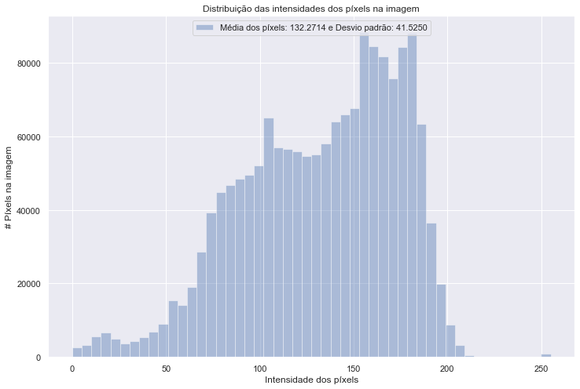
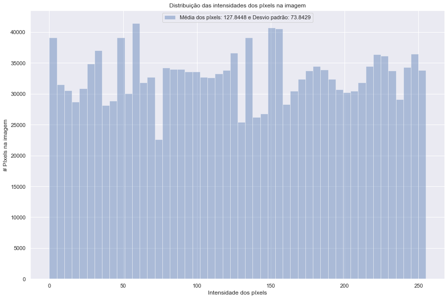
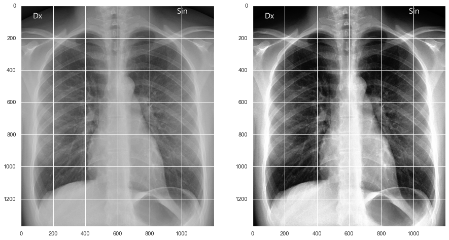
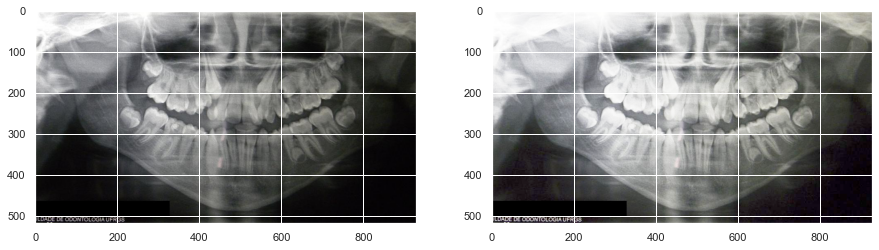
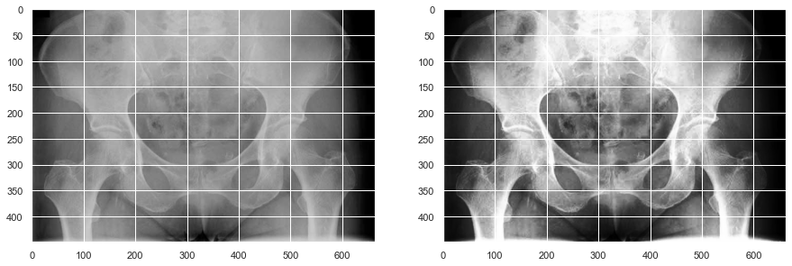
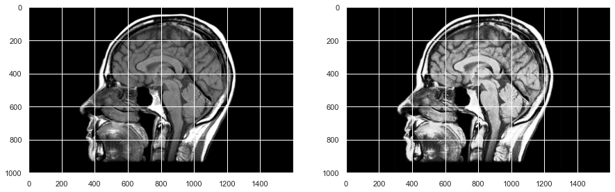

# Equalização de Histograma
***
A equalização de histograma é uma ação para mudar a distribuição dos valores de ocorrência em um histograma, permitindo uma redução das diferenças acentuadas. Particularmente em imagens, é possível destacar detalhes não visíveis anteriormente.

## O que é um histograma de uma imagem?
***
Um histograma de uma imagem é a interpretação gráfica dos valores de intensidade de pixel da imagem. Pode ser interpretado como a estrutura de dados que armazena as frequências de todos os níveis de intensidade de pixel na imagem. 


> Histograma sem equalização  


> Histograma com equalização  

## O que é equalização de histograma?
***
Equalização de histograma é uma técnica de processamento de imagem que ajusta o contraste de uma imagem usando seu histograma. Para aumentar o contraste da imagem, ele espalha os valores de intensidade de pixel mais frequentes ou estende a faixa de intensidade da imagem. Ao fazer isso, a equalização do histograma permite que as áreas da imagem com menor contraste ganhem maior contraste.


## Por que usar a equalização do histograma?
***
A equalização do histograma pode ser usada quando se tem imagens que parecem desbotadas porque não têm contraste suficiente. Nessas fotografias, as áreas claras e escuras se misturam, criando uma imagem mais plana, sem realces e sombras.






## Clonando o Repositório
***
Crie em algum lugar do seu PC uma pasta para clonar o repositório. com o Git instalado, insira o seguinte comando:

```
git clone https://github.com/Alyssonmach/histogram-equalization.git
```

## Implementando no Keras
***
Se olharmos a documentação do Keras para a classe `ImageDataGenerator`, veremos que podemos conectar nossa própria função de pré-processamento simplesmente especificando um retorno de chamada com o parâmetro `preprocessing_function`. Este retorno de chamada será executado para todas as imagens depois que todos os outros aumentos de dados Keras padrão forem executados. Nesse retorno de chamada, podemos modificar ainda mais a imagem com nossa própria rotina. É uma solução rápida e simples. Você o chamaria assim: `ImageDataGenerator (preprocessing_function = my_custom_function)` e simplesmente implementaria `my_custom_function(image_input)`. Abaixo, segue um exemplo mais detalhado da implementação.

```
from keras.preprocessing.image import ImageDataGenerator
from histogram_equalization import histogram_equalization

image_generator = ImageDataGenerator(preprocessing_function = histogram_equalization)
```

- [Documentação do Keras para mais detalhes](https://keras.io/api/preprocessing/image/)
